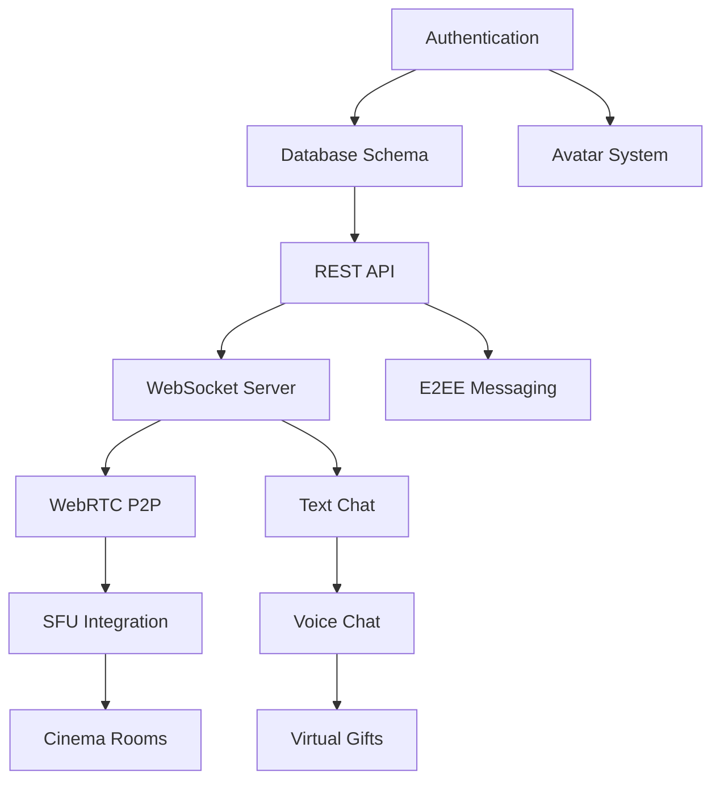

# Buddy Hunt - MVP Development Plan

## Epic Breakdown & Sprint Planning

### Phase 1: Core Infrastructure (Sprints 1-3)
**Duration**: 6 weeks | **Priority**: Critical

#### Epic 1.1: Authentication & User Management
**Sprint 1 (Week 1-2)**
- [ ] **User Registration/Login System**
  - Implement OAuth2 flows (Google, Facebook, Apple)
  - Email/password authentication with verification
  - JWT token management with refresh tokens
  - **AC**: Users can register, verify email, login, and maintain session across devices
  - **Estimate**: 8 story points

- [ ] **Profile Management**
  - Basic profile creation (username, avatar, bio)
  - Privacy settings (online status, profile visibility)
  - Account deletion/deactivation
  - **AC**: Users can create and manage complete profiles with privacy controls
  - **Estimate**: 5 story points

#### Epic 1.2: Core Database & API Foundation
**Sprint 2 (Week 3-4)**
- [ ] **Database Schema Implementation**
  - User management tables with proper indexing
  - Room/Cinema/Mansion table structures
  - Message queuing and storage design
  - **AC**: All core entities properly modeled with optimal query performance
  - **Estimate**: 13 story points

- [ ] **REST API Foundation**
  - User CRUD operations with validation
  - Room management endpoints
  - File upload handling (avatars, media)
  - **AC**: All core API endpoints functional with proper error handling
  - **Estimate**: 8 story points

#### Epic 1.3: Real-time Infrastructure
**Sprint 3 (Week 5-6)**
- [ ] **WebSocket Server Implementation**
  - Socket.IO server with room management
  - Message broadcasting and presence tracking
  - Connection state management with reconnection
  - **AC**: Real-time messaging functional across all room types
  - **Estimate**: 13 story points

### Phase 2: Streaming & Communication (Sprints 4-7)
**Duration**: 8 weeks | **Priority**: Critical

#### Epic 2.1: WebRTC Implementation
**Sprint 4-5 (Week 7-10)**
- [ ] **Basic P2P Video/Audio**
  - WebRTC peer connection establishment
  - Media stream capture and sharing
  - Basic signaling server implementation
  - **AC**: 1-on-1 video calls functional with <500ms latency
  - **Estimate**: 21 story points

- [ ] **Screen Sharing Foundation**
  - Desktop capture implementation
  - Application window sharing
  - Audio/video synchronization
  - **AC**: Screen sharing works reliably across browsers
  - **Estimate**: 13 story points

#### Epic 2.2: Cinema Streaming Rooms
**Sprint 6-7 (Week 11-14)**
- [ ] **SFU Integration**
  - mediasoup server deployment
  - Multi-party video conferencing (up to 8 participants)
  - Adaptive bitrate streaming
  - **AC**: Cinema rooms support 8 concurrent streamers with <300ms latency
  - **Estimate**: 34 story points

- [ ] **High-Quality Streaming**
  - 4K stream support with fallback
  - 60fps video streaming optimization
  - Network adaptation and quality scaling
  - **AC**: Streams maintain native resolution up to 4K where network permits
  - **Estimate**: 21 story points

### Phase 3: Social Features (Sprints 8-11)
**Duration**: 8 weeks | **Priority**: High

#### Epic 3.1: Mansions (Social Rooms)
**Sprint 8-9 (Week 15-18)**
- [ ] **Text Chat System**
  - Real-time messaging with typing indicators
  - Message history and pagination
  - Emoji reactions and rich text
  - **AC**: Smooth real-time chat experience with message persistence
  - **Estimate**: 13 story points

- [ ] **Voice Chat Integration**
  - Push-to-talk and open mic modes
  - Audio quality optimization
  - Noise suppression and echo cancellation
  - **AC**: Crystal clear voice communication in group rooms
  - **Estimate**: 13 story points

#### Epic 3.2: Virtual Gifts & Social Economy
**Sprint 10-11 (Week 19-22)**
- [ ] **Gift System Implementation**
  - Virtual gift catalog and animations
  - In-app purchase integration
  - Gift sending/receiving mechanics
  - **AC**: Users can send/receive virtual gifts with animated effects
  - **Estimate**: 21 story points

### Phase 4: Advanced Features (Sprints 12-15)
**Duration**: 8 weeks | **Priority**: Medium

#### Epic 4.1: Avatar World
**Sprint 12-13 (Week 23-26)**
- [ ] **2D Avatar System**
  - Avatar customization interface
  - Animation state management
  - Social discovery through avatars
  - **AC**: Users can create and animate 2D avatars for social interaction
  - **Estimate**: 21 story points

#### Epic 4.2: E2EE Private Messaging
**Sprint 14-15 (Week 27-30)**
- [ ] **Signal Protocol Implementation**
  - X3DH key exchange implementation
  - Double Ratchet message encryption
  - Message ephemeral options
  - **AC**: Private messages are end-to-end encrypted with forward secrecy
  - **Estimate**: 34 story points

## Dependency Mapping

## Risk Mitigation

### Technical Risks
1. **WebRTC Compatibility**: Plan for extensive browser testing, fallback to HLS for unsupported clients
2. **SFU Scaling**: Implement auto-scaling with mediasoup clusters, monitor CPU/memory usage
3. **Network Latency**: Deploy regional SFU nodes, implement adaptive bitrate

### Resource Risks
1. **Development Bandwidth**: 6 full-stack developers, 2 DevOps engineers, 1 security specialist
2. **Infrastructure Costs**: Budget $5K-15K/month for production infrastructure scaling

## Success Metrics
- **Streaming Quality**: 95% of sessions achieve <300ms latency for groups <8
- **Reliability**: 99.9% uptime during peak hours
- **User Retention**: 40% DAU after 30 days post-launch